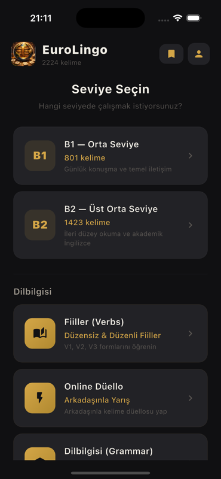
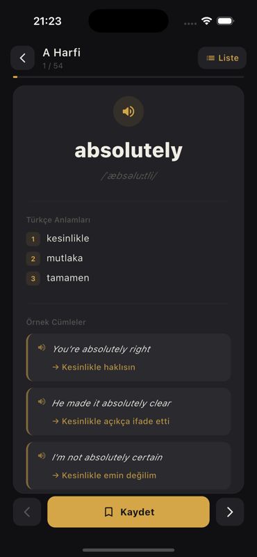
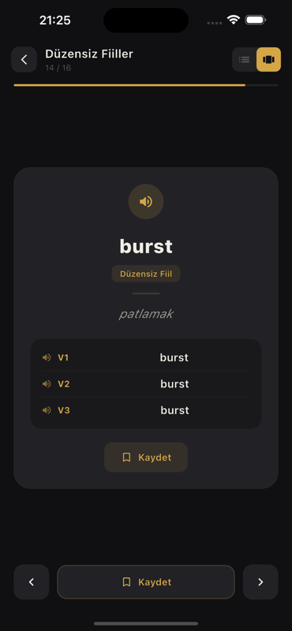
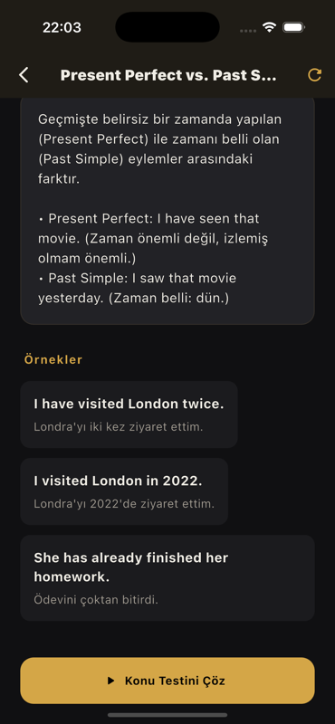
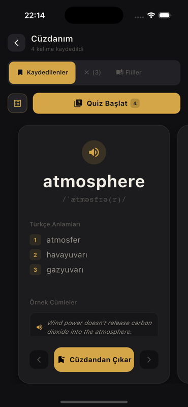
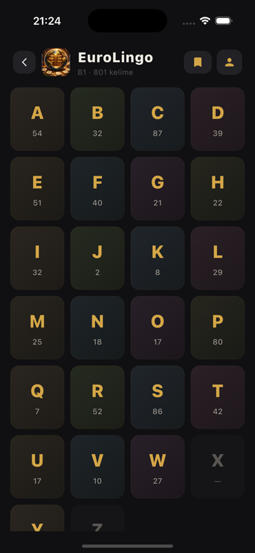
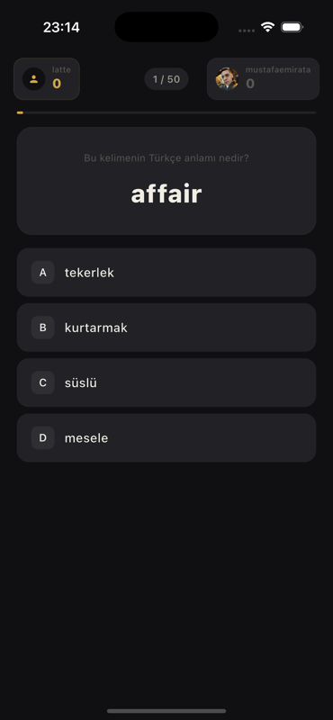
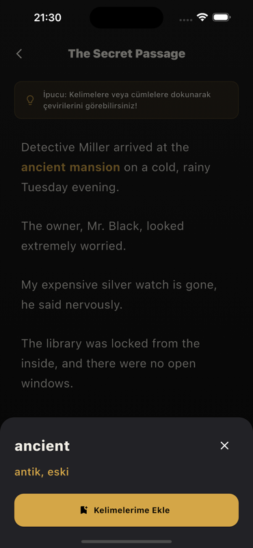

# 📚 Eurolingo

Modern, hızlı ve motive edici bir kelime öğrenme uygulaması.  
Tekrar, quiz ve düello sistemiyle öğrenmeyi kalıcı hale getirir.

---

## 🚀 Öne Çıkan Özellikler

### 🏠 Ana Modül

Dinamik ve modern ana sayfa ile tüm özelliklere hızlı erişim sağla.

---

### 🃏 Kartlarla Öğrenme

Kelime kartlarıyla hızlı öğren, tekrar et ve hafızana kazı.

---

### 🔊 Telaffuz Desteği

Kelimelerin doğru okunuşunu dinleyerek telaffuz pratikleri yap.

---

### 💬 Gramer & Örnek Cümleler

Kelimeleri sadece tekil halleriyle değil, gerçek cümle kullanımları içinde gör.

---

### ⭐ Cüzdan (Favoriler)

Önemli bulduğun kelimeleri cüzdanına kaydet ve dilediğin zaman tekrar et.

---

### 🧠 Quiz Modu

Farklı kategorilerdeki testlerle seviyeni ölç ve gelişimini takip et.

---

### ⚔️ Düello

Arkadaşlarınla veya diğer kullanıcılarla yarışarak öğrenmeyi eğlenceli hale getir.

---

### 📖 Hikaye ile Öğrenme

Kelimeleri hikaye bağlamında öğrenerek anlam bütünlüğünü kavra.

---

## 🎯 Neden Eurolingo?
- **Hızlı Öğrenme:** Odaklanmış içeriklerle vakit kaybetmeden ilerle.
- **Düzenli Tekrar:** Unutmaya karşı etkili tekrar sistemleri.
- **Oyunlaştırma:** Klasik yöntemlerin aksine sıkılmadan, yarışarak öğren.

---

## 🛠 Kullanılan Teknolojiler
- **Framework:** Flutter
- **Backend:** Firebase

---

## 👤 Geliştirici
**Mustafa Emir Ata**
