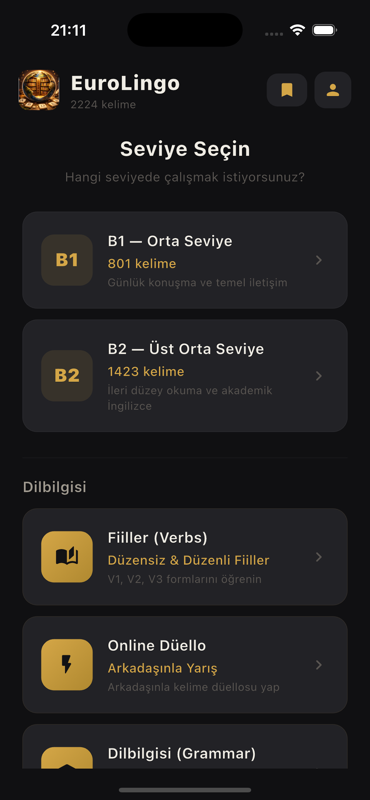
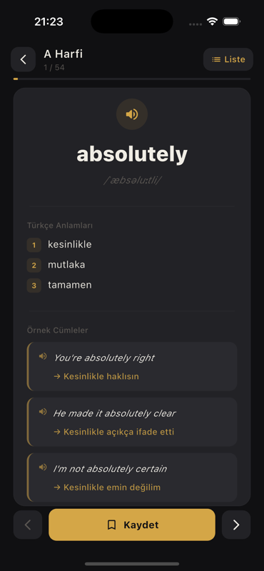
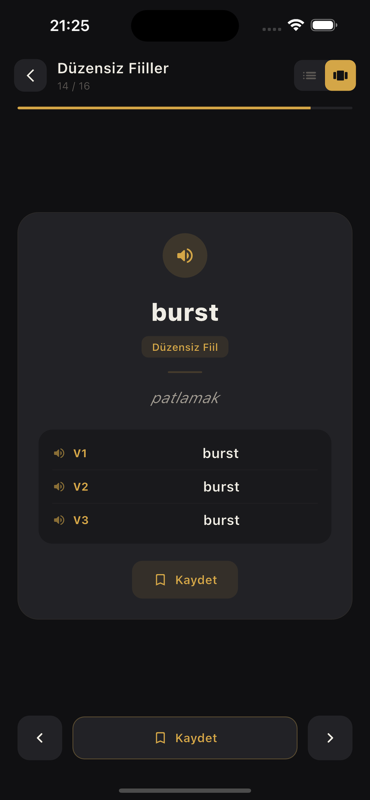
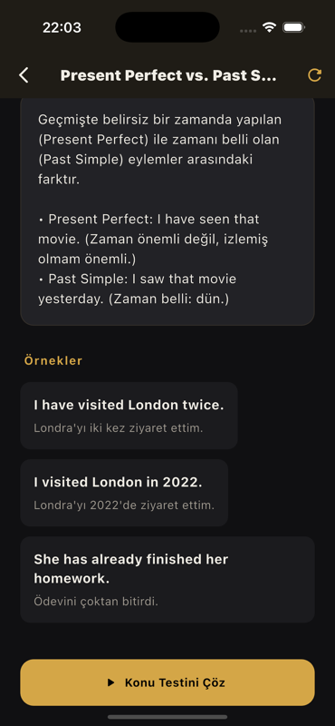
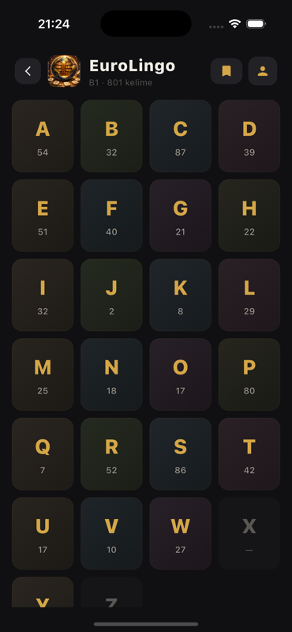
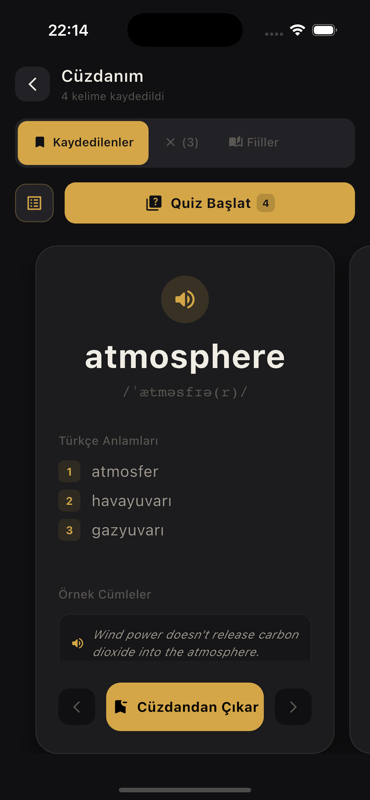
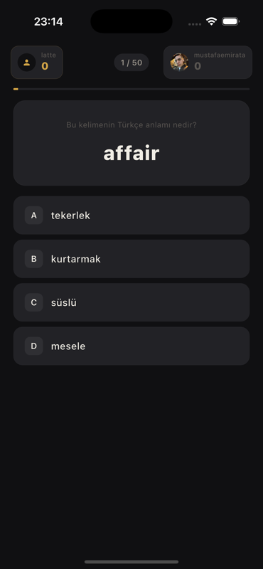
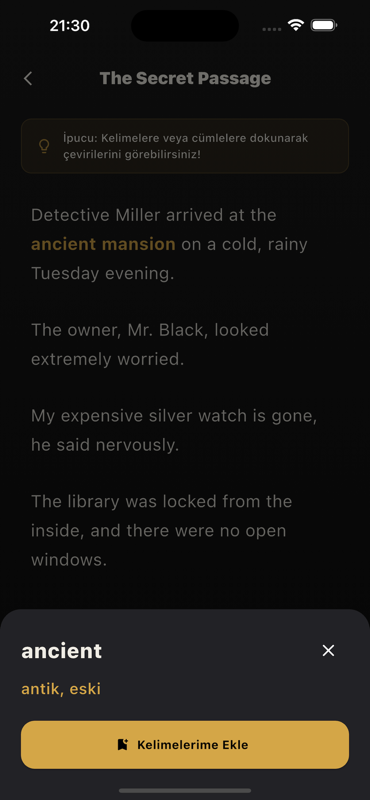

# 📚 Eurolingo

**Modern, hızlı ve motive edici bir kelime öğrenme deneyimi.** Eurolingo; tekrar sistemleri, interaktif quizler ve rekabetçi düello moduyla dil öğrenmeyi bir alışkanlığa dönüştürür. Kelimeleri sadece ezberletmez, cümle içindeki kullanımları ve hikayelerle zihninize kazır.

---

## 📲 Uygulamayı İndirin

Uygulamanın canlı versiyonunu incelemek ve kelime dağarcığınızı geliştirmeye başlamak için aşağıdaki butona tıklayabilirsiniz:

> **Not:** Uygulama içi tüm içerikler modern iOS ve Android standartlarına uygun olarak optimize edilmiştir.

---

## 📱 Ekran Görüntüleri & Modüller

Uygulamanın temel özelliklerini ve arayüzünü aşağıda görebilirsiniz:

<table style="width: 100%; text-align: center;">
  <tr>
    <td style="width: 33%;"><strong>🏠 Ana Modül</strong></td>
    <td style="width: 33%;"><strong>🃏 Kartlarla Öğrenme</strong></td>
    <td style="width: 33%;"><strong>🔊 Telaffuz & Pratik</strong></td>
  </tr>
  <tr>
    <td></td>
    <td></td>
    <td></td>
  </tr>
  <tr>
    <td><strong>💬 Gramer & Örnekler</strong></td>
    <td><strong>🧠 Quiz Modu</strong></td>
    <td><strong>⭐ Kelime Cüzdanı</strong></td>
  </tr>
  <tr>
    <td></td>
    <td></td>
    <td></td>
  </tr>
  <tr>
    <td><strong>⚔️ Düello Sistemi</strong></td>
    <td><strong>📖 Hikaye Modu</strong></td>
    <td></td>
  </tr>
  <tr>
    <td></td>
    <td></td>
    <td></td>
  </tr>
</table>

---

## 🎯 Neden Eurolingo?

- **Hızlı Öğrenme:** Gereksiz detaylardan arındırılmış, doğrudan sonuca odaklı içerik.
- **Oyunlaştırma:** Düello moduyla arkadaşlarınla yarışarak öğrenme motivasyonunu yüksek tut.
- **Bağlamsal Öğrenme:** Kelimeleri sadece tekil değil, hikaye ve cümle yapıları içinde kavra.
- **Kişiselleştirme:** Zorlandığın kelimeleri "Cüzdan"ına ekle ve sana özel tekrar listesi oluştur.

---

## 🛠 Kullanılan Teknolojiler

Uygulama, performans ve ölçeklenebilirlik odaklı modern teknolojilerle geliştirilmiştir:

- **Frontend:** [Flutter](https://flutter.dev/) (Cross-platform Excellence)
- **Backend:** [Firebase](https://firebase.google.com/) (Real-time Database & Auth)

---

## 👨‍💻 Geliştirici

**Mustafa Emir Ata** *Computer Engineering Student & Mobile Developer*

---

## ⭐ Destek
Eğer projeyi veya uygulamayı beğendiyseniz, GitHub üzerinden bir yıldız (⭐) vererek destek olabilirsiniz!
